# Сети в Linux

## Part 1. Инструмент ipcalc

### 1.1 Сети и маски

1. Адрес сети 192.167.38.54/13.

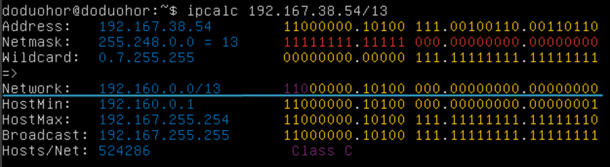

2. Перевод масок.

```
255.255.255.0 в префиксную и двоичную запись
```
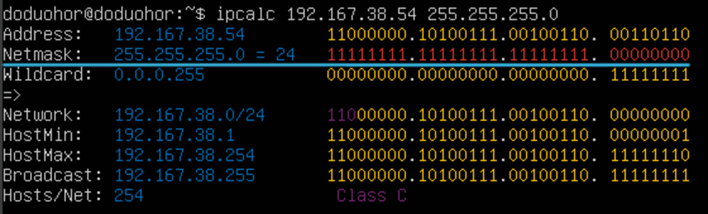

```
/15 в обычную и двоичную
```
    
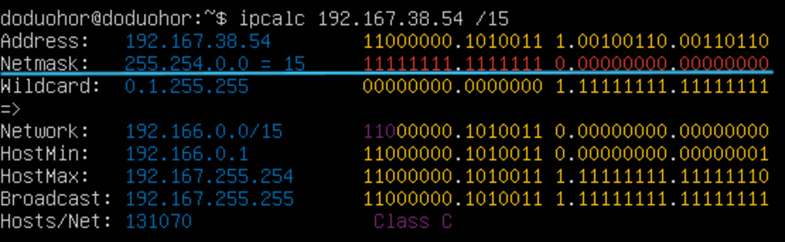


```
11111111.11111111.11111111.11110000 в обычную и префиксную
```

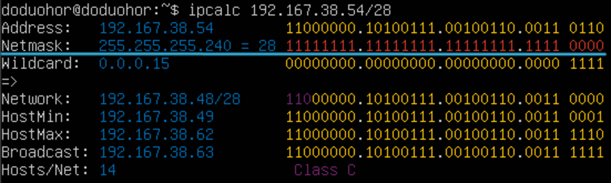

3. Минимальные и максимальные хосты сети 12.167.38.4

```
При маске /8
```

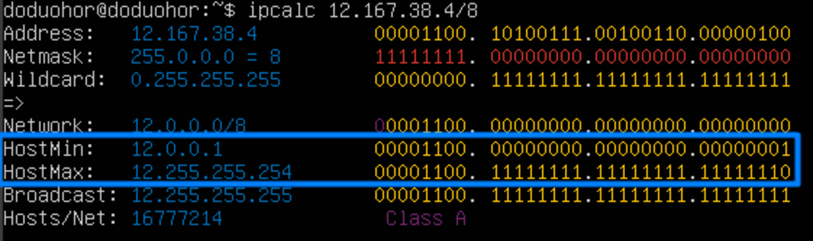

```
При маске 11111111.11111111.00000000.00000000
```

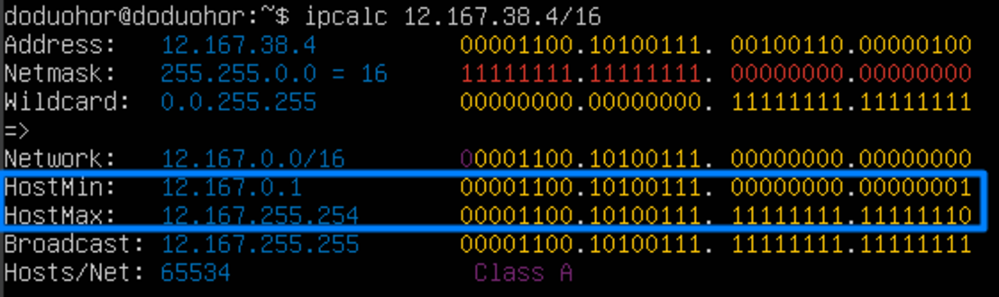


```
При маске 255.255.254.0
```

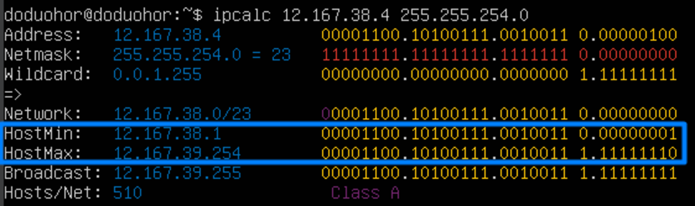

```
При маске /4
```

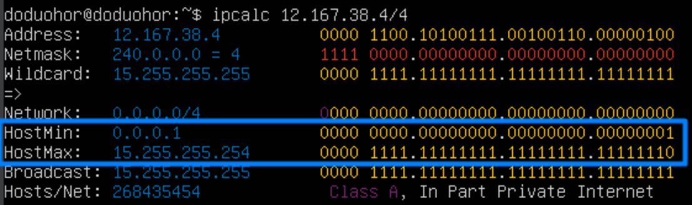

### 1.2 Localhost

- Определить и записать в отчёт, можно ли обратиться к приложению, работающему на localhost, со следующими IP: 194.34.23.100, 127.0.0.2, 127.1.0.1, 128.0.0.1

```
Адреса типа "localhost" находятся в диапазоне от 127.0.0.1 до 127.255.255.255.
Следовательно:
Можно обратиться: 127.0.0.2, 127.0.0.1
Нельзя обратиться: 194.34.23.100, 128.0.0.1
```

```
Также есть возможность проверить имеет ли определенный ip-адрес тип "localhost", используя команду ipcalc, а именно вывод строчки Hosts/Net. Необходимо обратить внимание на наличие слова "Loopback", означающая, что соответствующий IP-адрес является адресом петли обратной связи (loopback) и, следовательно, относится к типу "localhost". Важно отметить, что хоть и наличие является сильным указанием на отношение к типу "localhost", но при этом не является однозначным доказательством принадлежности к данному типу.
```

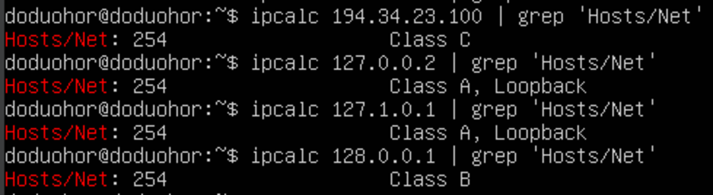

### 1.3 Диапазоны и сегменты сетей

1) Какие из перечисленных IP можно использовать в качестве публичного, а какие только в качестве частных: 10.0.0.45, 134.43.0.2, 192.168.4.2, 172.20.250.4, 172.0.2.1, 192.172.0.1, 172.68.0.2, 172.16.255.255, 10.10.10.10, 192.169.168.1

```
IP-адреса могут быть разделены на публичные и частные в соответствии с определенными диапазонами адресов, установленными организацией Internet Assigned Numbers Authority (IANA) и Internet Engineering Task Force (IETF).
Публичные IP-адреса:
    1. 0.0.0.0 - 126.255.255.255
    2. 128.0.0.0 - 191.255.255.255
    3. 192.0.0.0 - 223.255.255.255
    4. 224.0.0.0 - 239.255.255.255 (зарезервированы для многоадресной рассылки и не используются для обычных узлов сети)
    5. 240.0.0.0 - 255.255.255.254 (зарезервированы для специальных целей и не используются для общего доступа в интернет)
Частные IP-адреса:
    1. 10.0.0.0 - 10.255.255.255 (10.0.0.0/8)
    2. 172.16.0.0 - 172.31.255.255 (172.16.0.0/12)
    3. 192.168.0.0 - 192.168.255.255 (192.168.0.0/16)
Следовательно: 
  Публичные: 134.43.0.2, 172.0.2.1, 192.172.0.1, 172.68.0.2, 192.169.168.1.
  Частные: 10.0.0.45, 192.168.4.2, 172.20.250.4,  172.16.255.255, 10.10.10.10.
```
```
С помощью инструмента ipcalc также есть возможность проверить является ли определенный IP-адрес публичным или частным. Определить данный факт можно с помощью наличия словосочетания "Private Internet" в выводе команды "ipcalc", а именно в строчке "Hosts/Net", что означает принадлежность данного адреса к группе частных адресов.
```

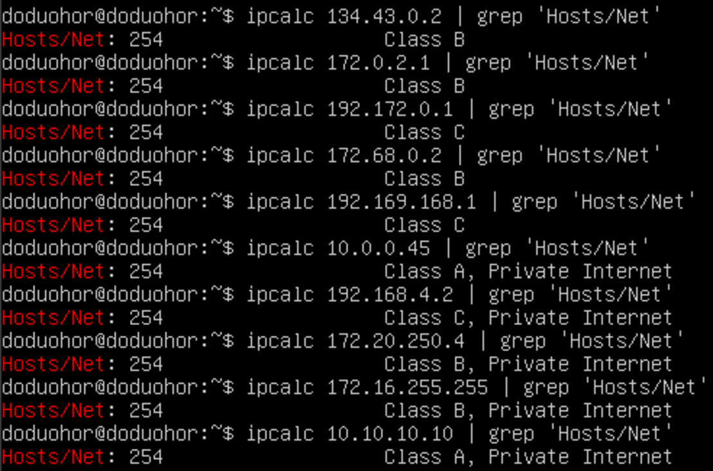

## Part 2. Статическая маршрутизация между двумя машинами

```
Поднять две виртуальные машины (далее -- ws1 и ws2)
```
```
С помощью команды ip a посмотреть существующие сетевые интерфейсы
```
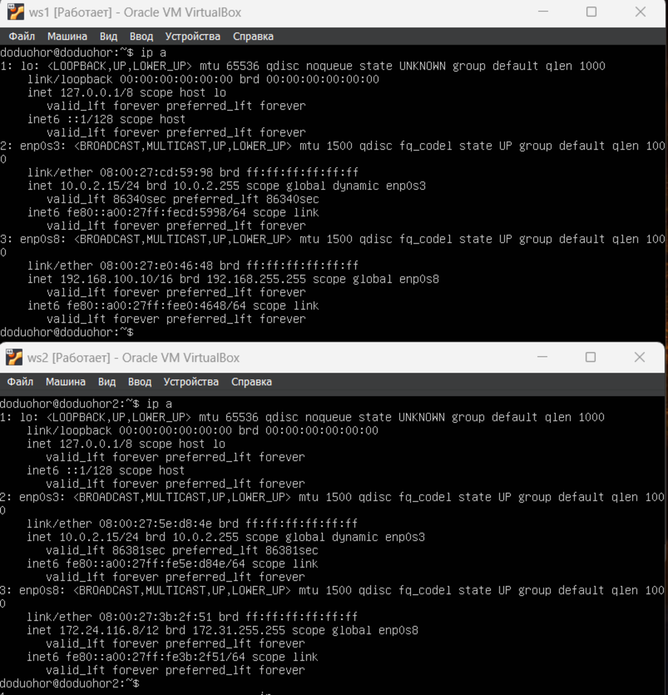

```
Описать сетевой интерфейс, соответствующий внутренней сети, на обеих машинах и задать следующие адреса и маски: ws1 - 192.168.100.10, маска /16, ws2 - 172.24.116.8, маска /12
```
```
Интерфейс "lo" (loopback) является специальным сетевым интерфейсом на компьютере, который используется для обратной петли или локальной обратной связи. Он представляет собой виртуальный интерфейс, который позволяет устройству обмениваться сетевыми пакетами самому с собой без фактической передачи через физическую сеть.
Информация о сетевом интерфейсе "lo" в выводе команды `ip addr` выглядит следующим образом:

- `<LOOPBACK,UP,LOWER_UP>`: это состояние интерфейса. "LOOPBACK" указывает, что это loopback-интерфейс. "UP" означает, что интерфейс включен и работает. "LOWER_UP" указывает на фактическое состояние физического устройства, связанного с интерфейсом.
- `mtu 65536`: это максимальный размер передаваемого пакета (Maximum Transmission Unit) для интерфейса loopback.
- `qdisc noqueue`: это указывает на отсутствие очередей обработки пакетов (noqueue).
- `state UNKNOWN`: это состояние интерфейса, которое здесь указывает на неопределенное состояние.
- `group default`: это группа, к которой интерфейс принадлежит (default).
- `qlen 1000`: это длина очереди пакетов, которые могут быть помещены в интерфейс (1000).
- `link/loopback 00:00:00:00:00:00 brd 00:00:00:00:00:00`: это данные о сетевом соединении и MAC-адресе интерфейса. В данном случае, MAC-адрес не определен (00:00:00:00:00:00).
- `inet 127.0.0.1/8 scope host lo`: это IPv4-адрес (127.0.0.1) и его сетевая маска (/8), указывающие, что адрес находится в пределах самого устройства (scope host) и принадлежит интерфейсу "lo".
- `valid_lft forever preferred_lft forever`: это параметры времени жизни адреса, где "forever" означает, что адрес действителен постоянно и предпочтительный.
- `inet6 ::1/128 scope host`: это IPv6-адрес (::1) и его сетевая маска (/128), указывающие, что адрес находится в пределах самого устройства (scope host).

```

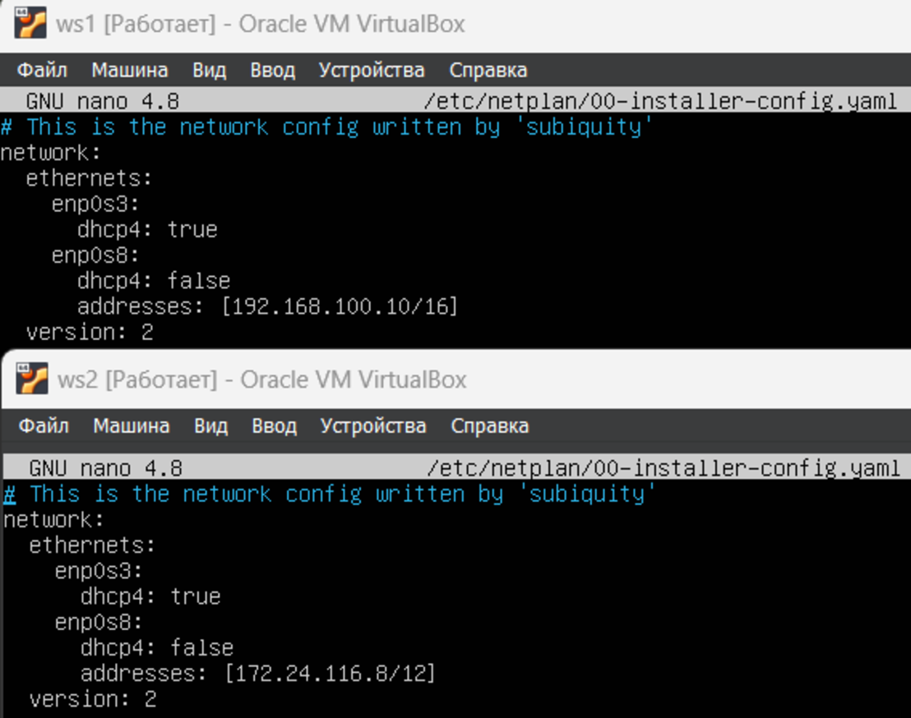

```
Выполнить команду netplan apply для перезапуска сервиса сети
```
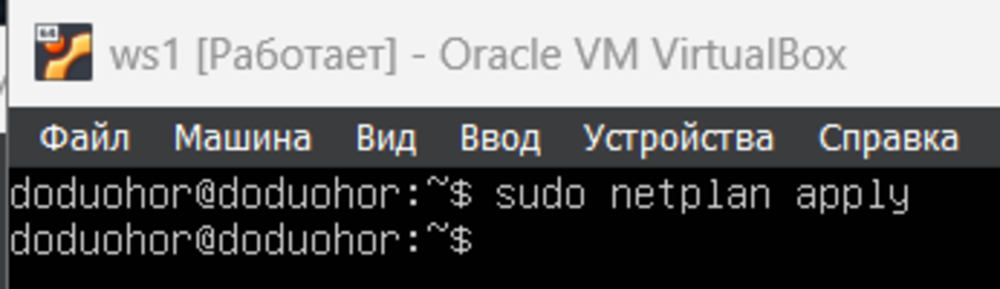

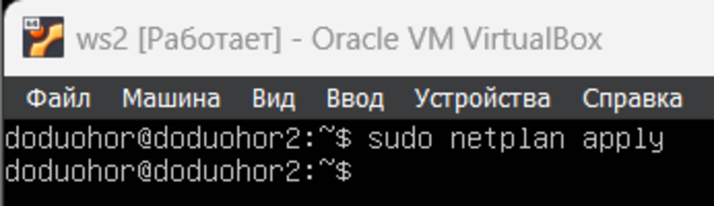

### 2.1. Добавление статического маршрута вручную

```
Добавить статический маршрут от одной машины до другой и обратно при помощи команды вида ip r add
```
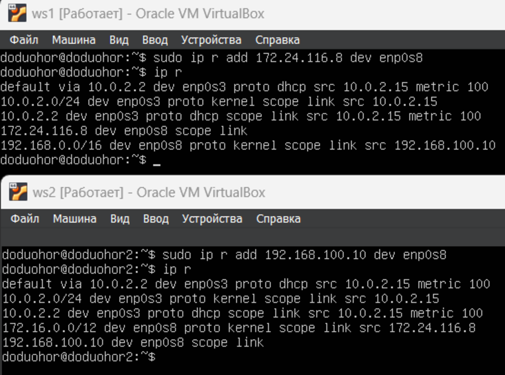
```
Пропинговать соединение между машинами
```
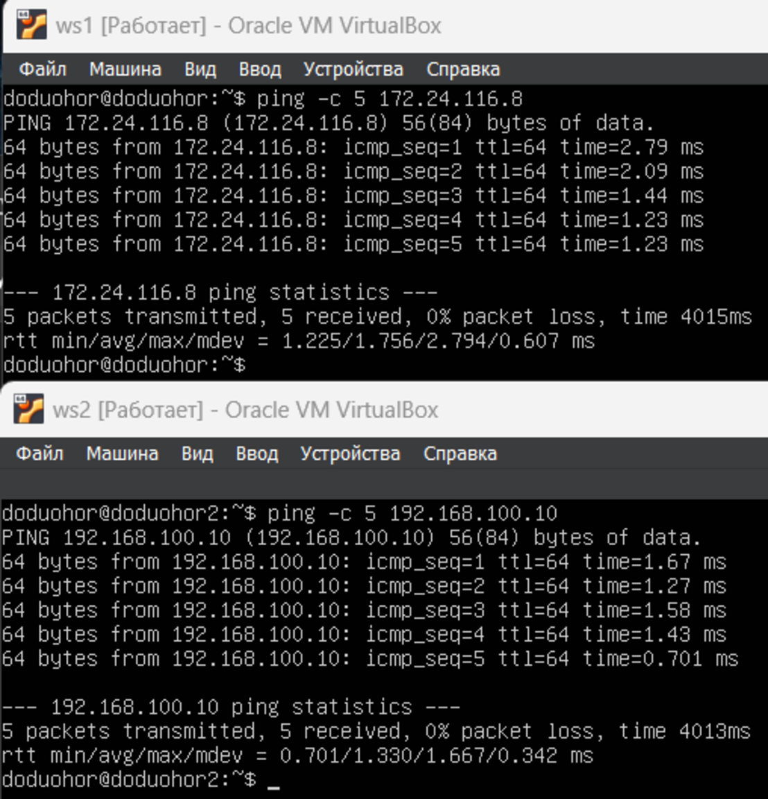

### 2.2. Добавление статического маршрута с сохранением

```
Перезапустить машины
```

```
Добавить статический маршрут от одной машины до другой с помощью файла etc/netplan/00-installer-config.yaml

В отчёт поместить скрин с содержанием изменённого файла etc/netplan/00-installer-config.yaml.
```
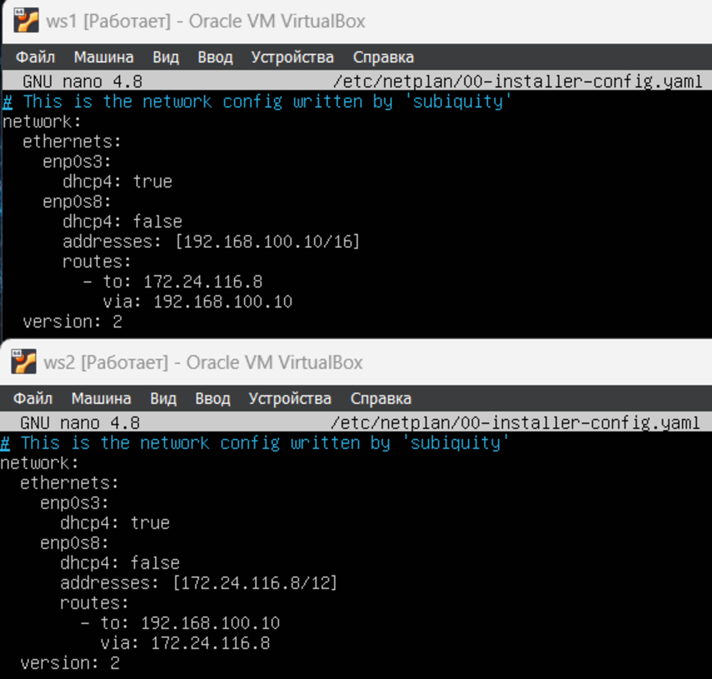

```
Пропинговать соединение между машинами

В отчёт поместить скрин с вызовом и выводом использованной команды.
```
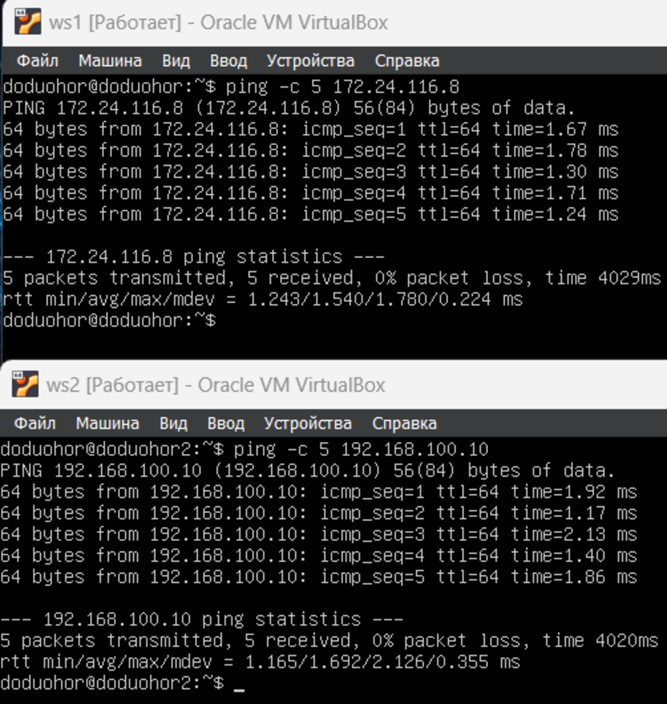

## Part 3. Утилита iperf3

### 3.1. Скорость соединения

```
Перевести и записать в отчёт: 8 Mbps в MB/s, 100 MB/s в Kbps, 1 Gbps в Mbps
```
    8 Mbps (мегабит) = 1 MB/s (мегабайт)
    100 MB/s (мегабайт) = 800 000 Kbps (килобит)
    1 Gbps (гигабит) = 1000 Mbps (мегабит)

### 3.2. Утилита iperf3

```
Измерить скорость соединения между ws1 и ws2
В отчёт поместить скрины с вызовом и выводом использованных команд.
```
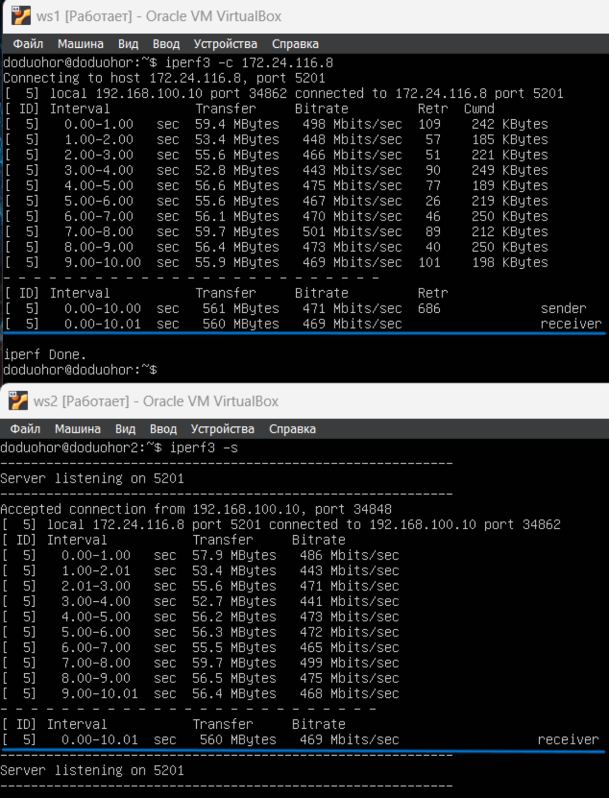

## Part 4. Сетевой экран

### 4.1. Утилита iptables

```
Создать файл /etc/firewall.sh, имитирующий фаерволл, на ws1 и ws2:

Нужно добавить в файл подряд следующие правила:

1) на ws1 применить стратегию когда в начале пишется запрещающее правило, а в конце пишется разрешающее правило (это касается пунктов 4 и 5)

2) на ws2 применить стратегию когда в начале пишется разрешающее правило, а в конце пишется запрещающее правило (это касается пунктов 4 и 5)

3) открыть на машинах доступ для порта 22 (ssh) и порта 80 (http)

4) запретить echo reply (машина не должна "пинговаться”, т.е. должна быть блокировка на OUTPUT)

5) разрешить echo reply (машина должна "пинговаться")

В отчёт поместить скрины с содержанием файла /etc/firewall для каждой машины.
```
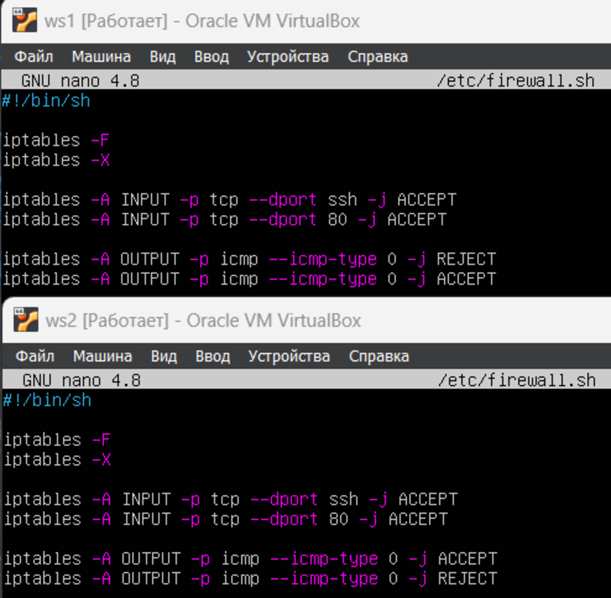

```
Запустить файлы на обеих машинах командами `chmod +x /etc/firewall.sh` и `/etc/firewall.sh`
В отчёт поместить скрины с запуском обоих файлов.
```
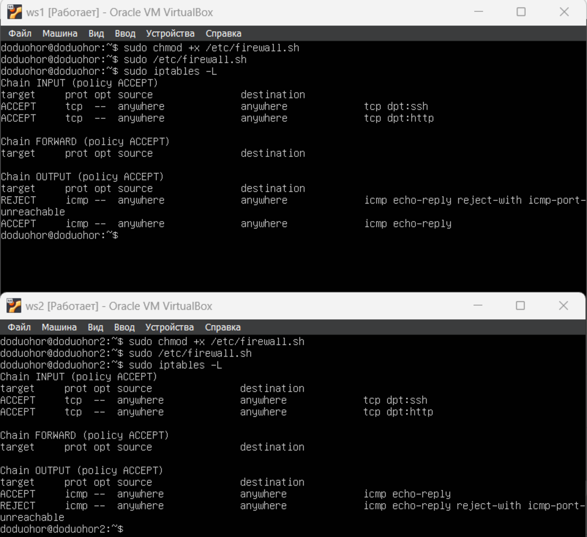

```
В отчёте описать разницу между стратегиями, применёнными в первом и втором файлах.
```
```
Когда пакет проходит через цепочку правил, оно проверяется по порядку, начиная с первого правила и продолжая до последнего. Когда пакет соответствует правилу, указанному в цепочке, применяется действие, указанное в правиле (например, ACCEPT или REJECT), и обработка пакета завершается.
В первом файле изначально пишется запрещающее правило с ключевым словом REJECT, которое добавляет новое правило в цепочку OUTPUT таблицы filter, которое совпадает с ICMP-пакетами типа Echo Reply (0) и выполняет действие REJECT, тем самым пакет не проходит через межсетевой экран, но отправляется сообщение об отклонении обратно отправителю. Далее второе правило игнорируется.
Во втором файле благодаря тому, что разрешающее правило стоит первее запрещающего, выполняется действие ACCEPT, то есть разрешает исходящие ICMP-пакеты типа Echo Reply (код 0), а второе (запрещающее) правило игнорируется.
```
## Part 5. Статическая маршрутизация сети

```
Поднять пять виртуальных машин (3 рабочие станции (ws11, ws21, ws22) и 2 роутера (r1, r2))
```


### 5.1. Настройка адресов машин

```
Настроить конфигурации машин в etc/netplan/00-installer-config.yaml согласно сети на рисунке.

В отчёт поместить скрины с содержанием файла etc/netplan/00-installer-config.yaml для каждой машины.
```
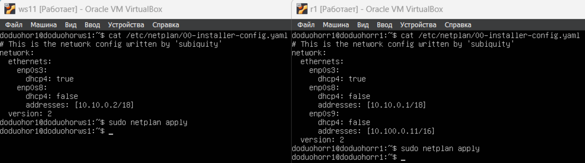

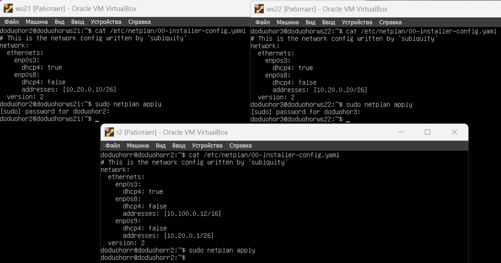

```
Перезапустить сервис сети. Если ошибок нет, то командой ip -4 a проверить, что адрес машины задан верно. Также пропинговать ws22 с ws21. Аналогично пропинговать r1 с ws11.

В отчёт поместить скрины с вызовом и выводом использованных команд.
```

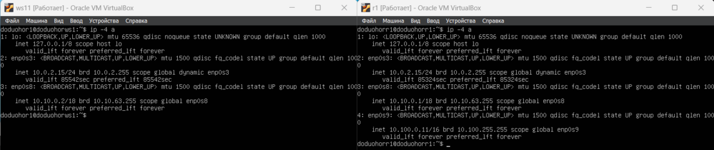

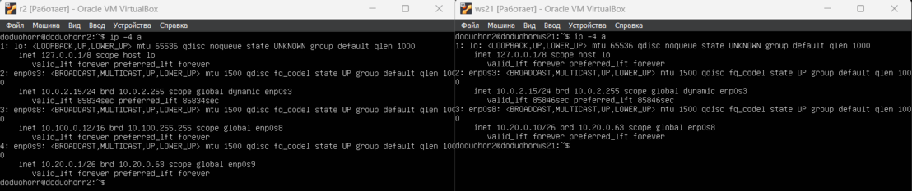

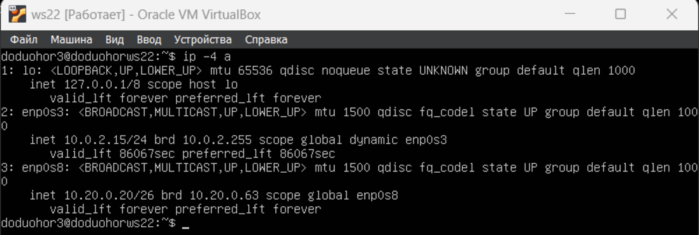

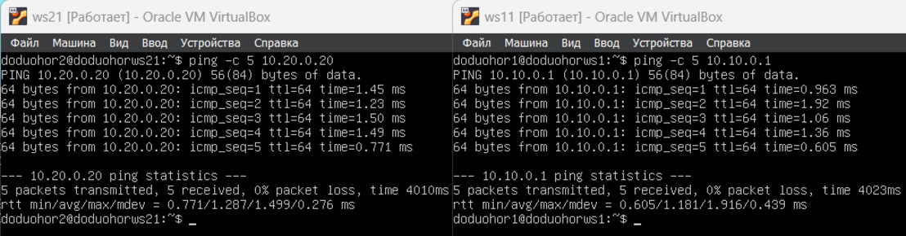

### 5.2. Включение переадресации IP-адресов.

```
Для включения переадресации IP, выполните команду на роутерах:
`sysctl -w net.ipv4.ip_forward=1`

В отчёт поместить скрин с вызовом и выводом использованной команды.
```


```
Откройте файл `/etc/sysctl.conf` и добавьте в него следующую строку:
`net.ipv4.ip_forward = 1`
```


### 5.3. Установка маршрута по-умолчанию

```
Настроить маршрут по-умолчанию (шлюз) для рабочих станций. Для этого добавить default перед IP роутера в файле конфигураций

В отчёт поместить скрин с содержанием файла etc/netplan/00-installer-config.yaml.
```
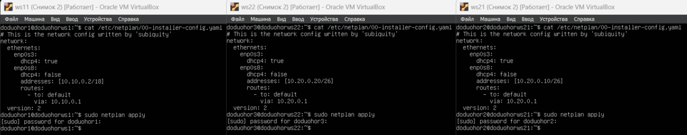

```
Вызвать ip r и показать, что добавился маршрут в таблицу маршрутизации

В отчёт поместить скрин с вызовом и выводом использованной команды.
```

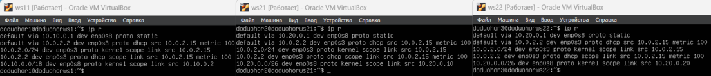

```
Пропинговать с ws11 роутер r2 и показать на r2, что пинг доходит. Для этого использовать команду:
`tcpdump -tn -i eth0`

В отчёт поместить скрин с вызовом и выводом использованных команд.
```


### 5.4. Добавление статических маршрутов

```
Добавить в роутеры r1 и r2 статические маршруты в файле конфигураций

В отчёт поместить скрины с содержанием изменённого файла etc/netplan/00-installer-config.yaml для каждого роутера.
```

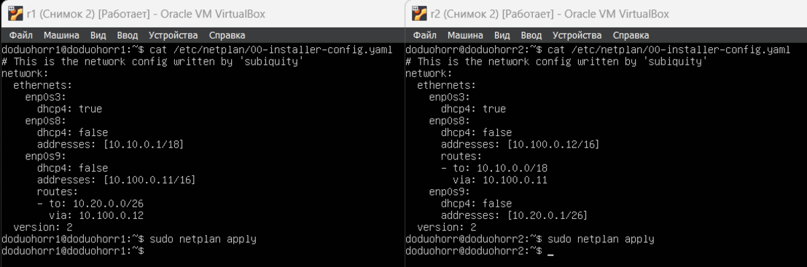

```
Вызвать `ip r` и показать таблицы с маршрутами на обоих роутерах.

В отчёт поместить скрин с вызовом и выводом использованной команды.
```


```
Запустить команды на ws11:

`ip r list 10.10.0.0/[маска сети]` и `ip r list 0.0.0.0/0`

В отчёт поместить скрин с вызовом и выводом использованных команд.
В отчёте объяснить, почему для адреса 10.10.0.0/[маска сети] был выбран маршрут, отличный от 0.0.0.0/0, хотя он попадает под маршрут по-умолчанию.
```


```
Различие между этими двумя результатами заключается в том, что маршрут для конкретной сети 10.10.0.0/18 указывает на интерфейс, к которому привязана эта сеть (dev enp0s3), в то время как маршрут по умолчанию указывает на конкретный шлюз (via 10.10.0.1), через который должны проходить все пакеты, не имеющие более специфичных маршрутов.
```

### 5.5. Построение списка маршрутизаторов

```
Запустить на r1 команду дампа: `tcpdump -tnv -i eth0`

При помощи утилиты traceroute построить список маршрутизаторов на пути от ws11 до ws21

В отчёт поместить скрины с вызовом и выводом использованных команд (tcpdump и traceroute).
В отчёте, опираясь на вывод, полученный из дампа на r1, объяснить принцип работы построения пути при помощи traceroute.
```
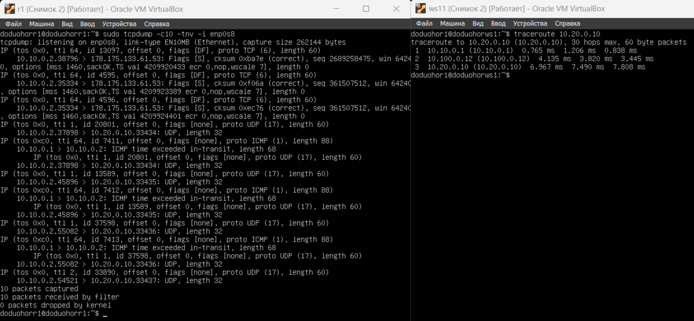

```
На основании вышеуказанного вывода можно проанализировать принцип работы построения пути при использовании команды traceroute. Вывод содержит информацию о пакетах, отправляемых на целевой IP-адрес, и откликах на каждый пакет от промежуточных узлов (маршрутизаторов) на пути к цели.

Каждая строка вывода представляет отдельный пакет, отправленный на целевой IP-адрес и полученный от промежуточных узлов.

После отправки пакета он проходит через промежуточные узлы на пути к целевому узлу. Если TTL (Time to Live) не равен нулю, пакет пропускается через маршрутизатор, и значение TTL уменьшается на 1. Если TTL достигает нуля, маршрутизатор отбрасывает пакет и отправляет обратно ICMP-сообщение "ICMP time exceeded in-transit" (время истекло) отправителю. Это позволяет определить промежуточные узлы на пути к цели.

Вывод traceroute помогает определить маршрут и время отклика от каждого промежуточного узла, что полезно для анализа сетевых проблем, оптимизации маршрутизации и диагностики задержек в сети.
```

### 5.6. Использование протокола ICMP при маршрутизации

```
Запустить на r1 перехват сетевого трафика, проходящего через eth0 с помощью команды:
tcpdump -n -i eth0 icmp

Пропинговать с ws11 несуществующий IP (например, 10.30.0.111) с помощью команды:
ping -c 1 10.30.0.111

В отчёт поместить скрин с вызовом и выводом использованных команд.
```
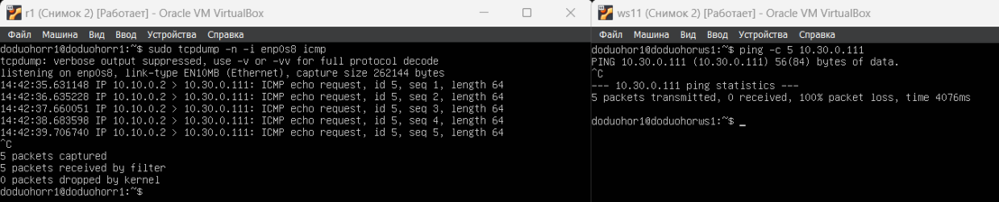

## Part 6. Динамическая настройка IP с помощью DHCP

```
Для r2 настроить в файле /etc/dhcp/dhcpd.conf конфигурацию службы DHCP:
1) указать адрес маршрутизатора по-умолчанию, DNS-сервер и адрес внутренней сети

```

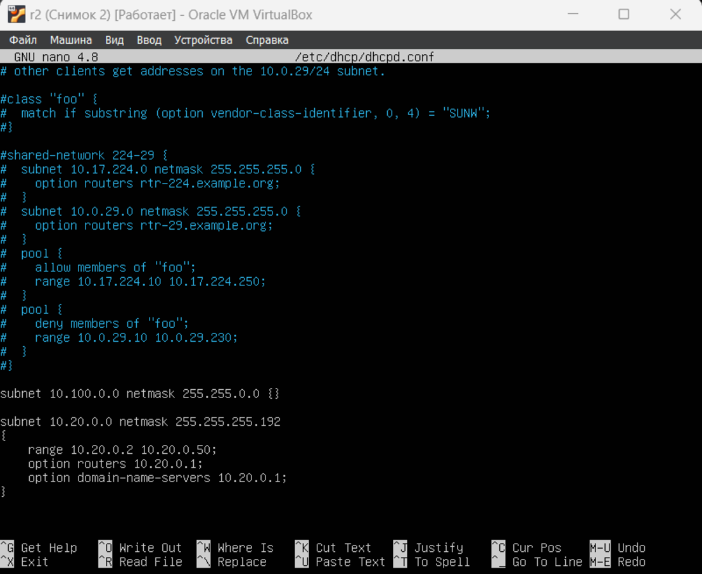

```
2) в файле resolv.conf прописать nameserver 8.8.8.8.

Перезагрузить службу DHCP командой systemctl restart isc-dhcp-server. 
```

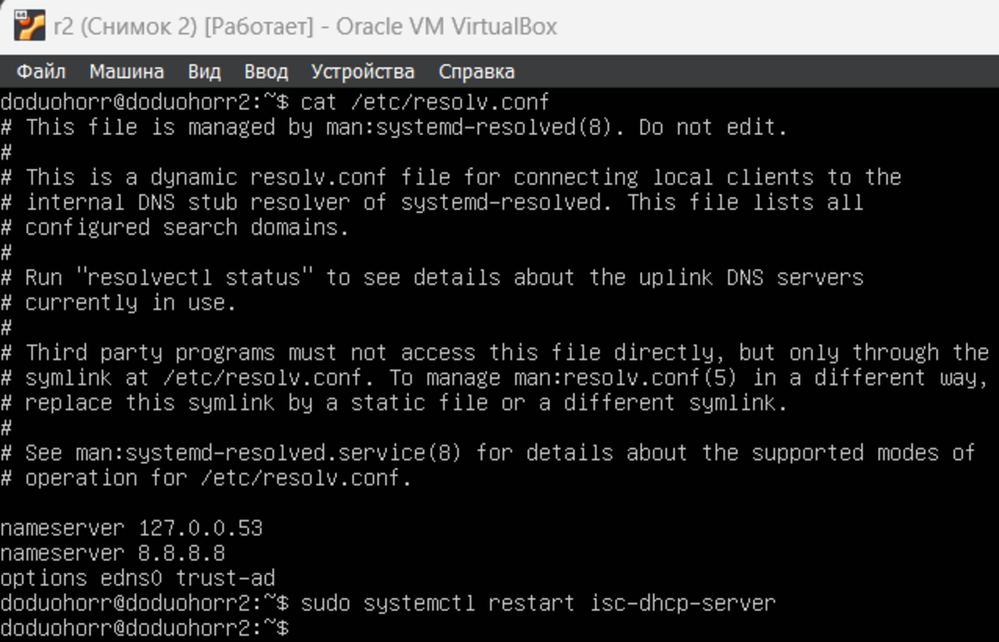

```
Машину ws21 перезагрузить при помощи reboot и через ip a показать, что она получила адрес. Также пропинговать ws22 с ws21.
```
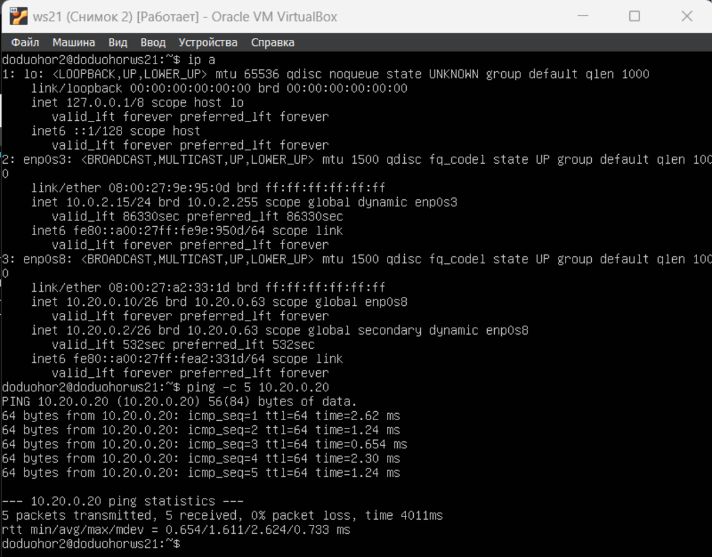

```
Указать MAC адрес у ws11, для этого в etc/netplan/00-installer-config.yaml надо добавить строки: macaddress: 10:10:10:10:10:BA, dhcp4: true
```
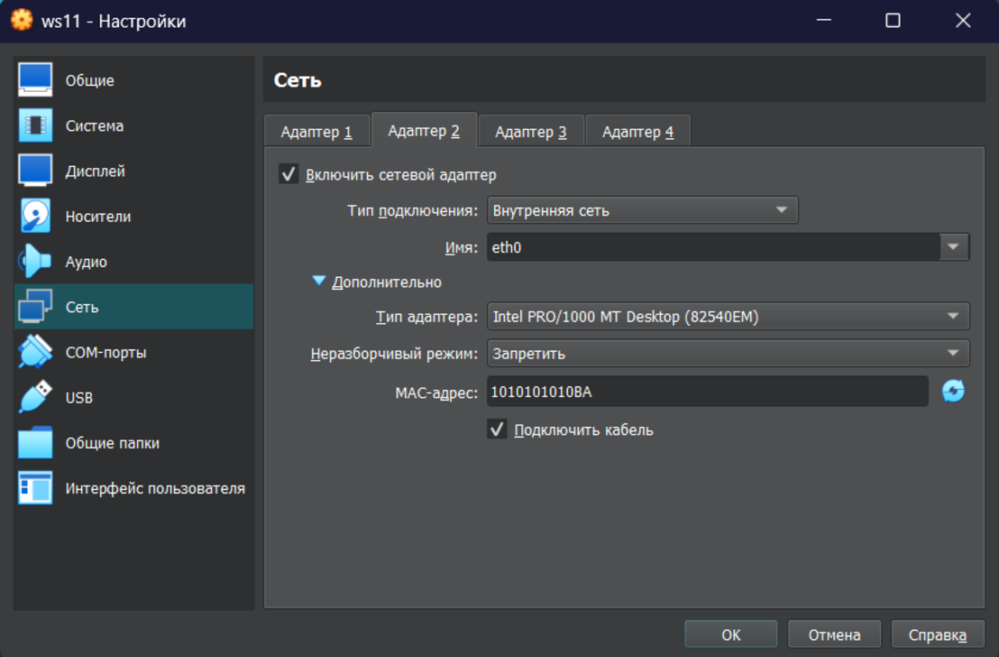

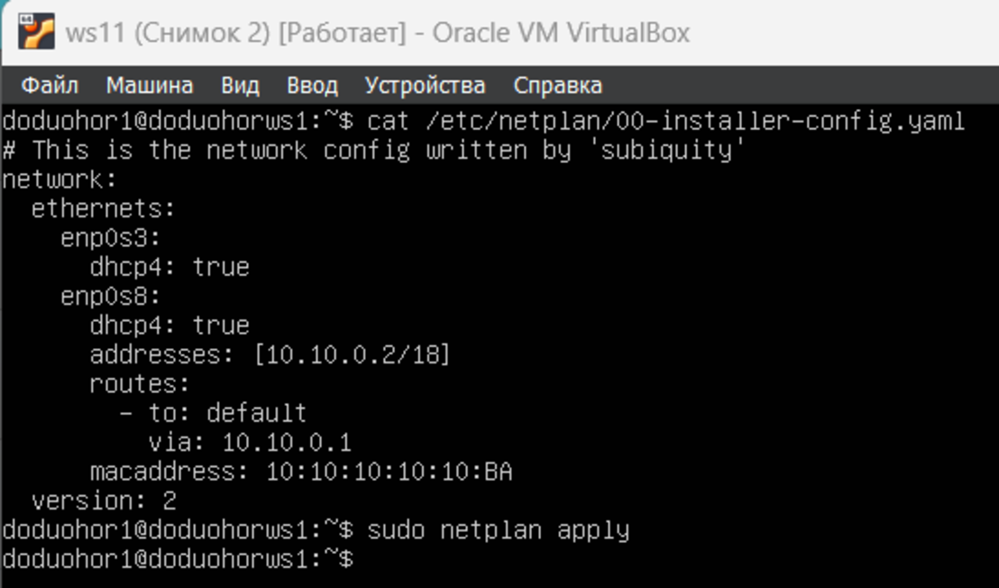

```
Для r1 настроить аналогично r2, но сделать выдачу адресов с жесткой привязкой к MAC-адресу (ws11).
```

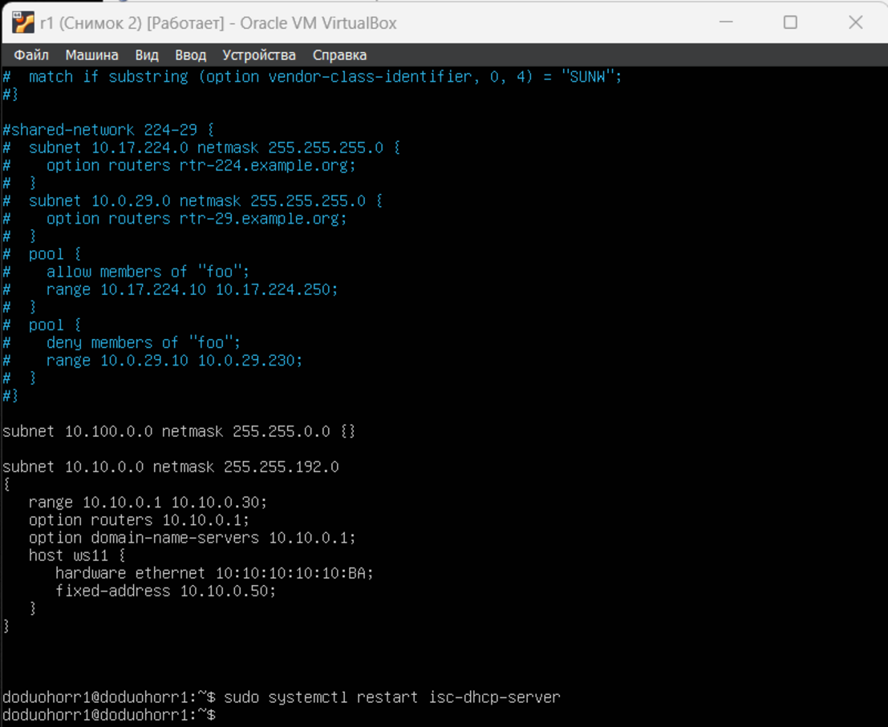

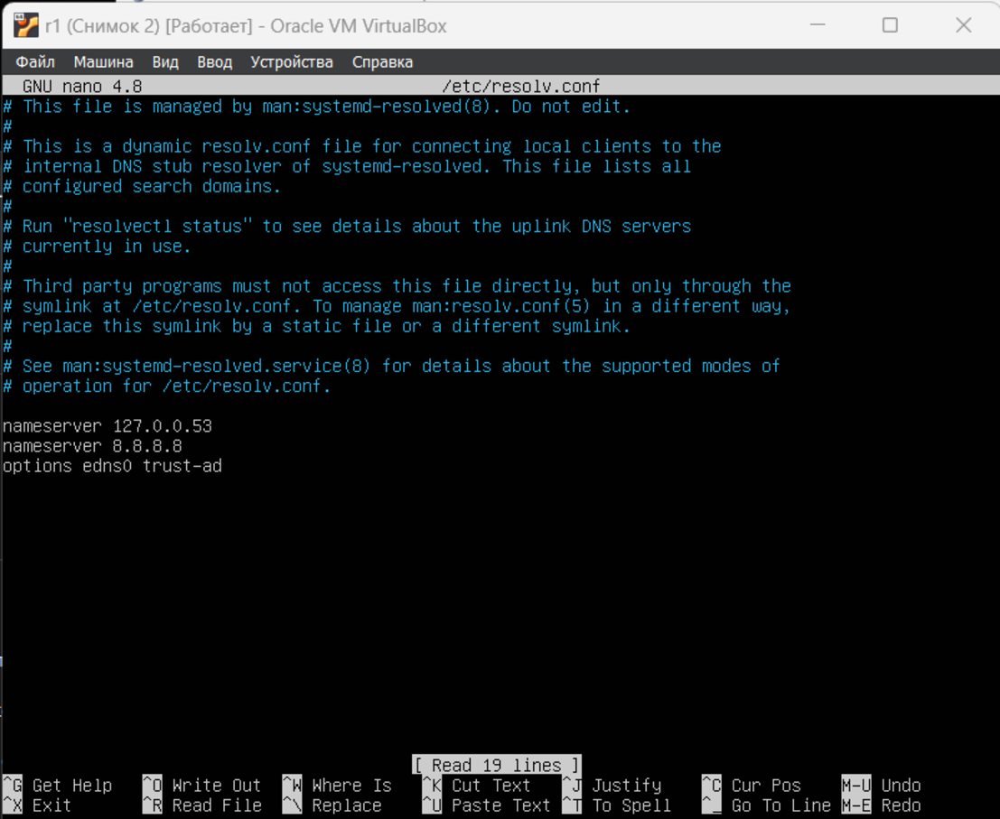

```
Провести аналогичные тесты
```
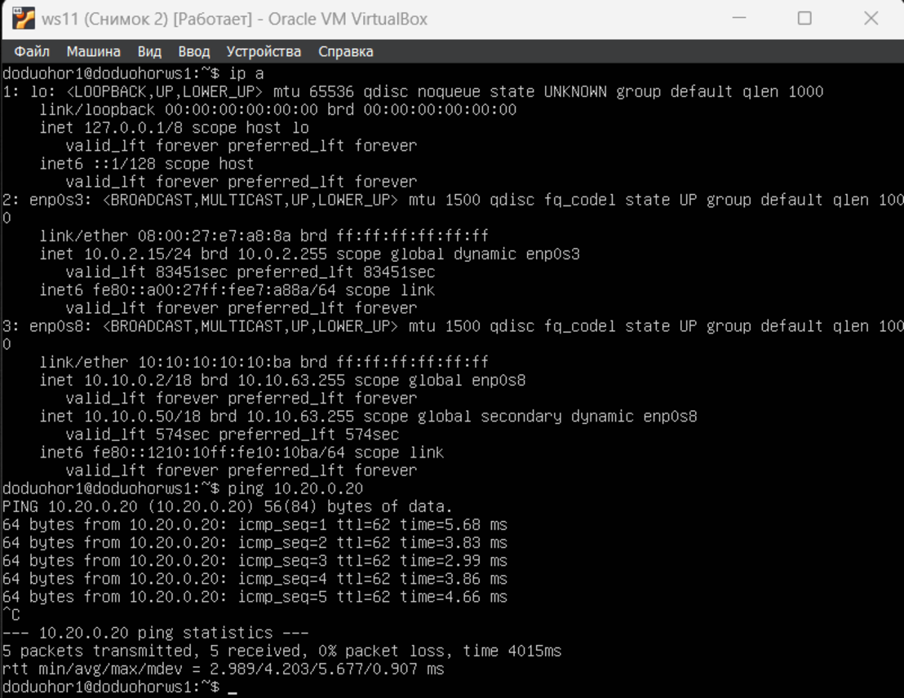

```
Запросить с ws21 обновление ip адреса
```
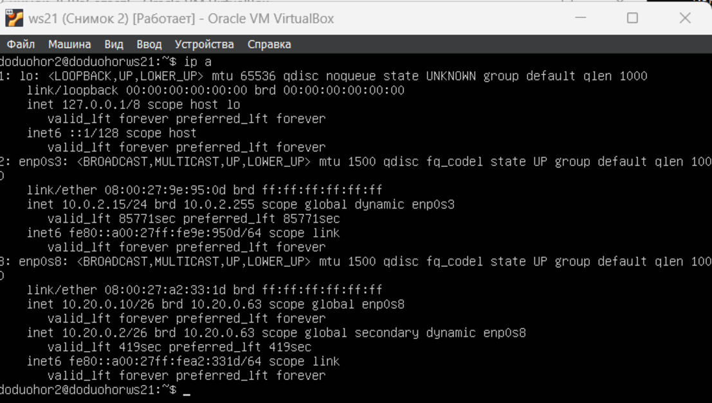

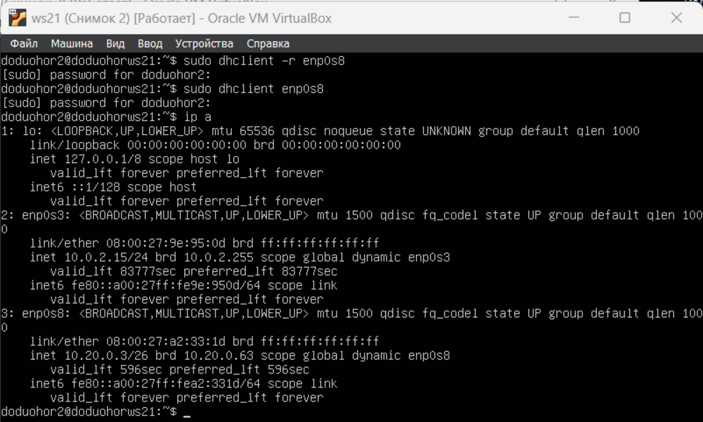

```
sudo dhclient -r enp0s8: Эта команда отправляет запрос на освобождение (release) сетевого интерфейса enp0s3. В ответ DHCP-серверу будет отправлено сообщение о том, что данный сетевой интерфейс больше не нуждается в выделенных ему сетевых настройках. После выполнения этой команды интерфейс будет освобожден, и все его сетевые настройки будут удалены.

sudo dhclient enp0s8: Эта команда запускает процесс получения (renew) сетевых настроек для сетевого интерфейса enp0s8 от DHCP-сервера. DHCP-сервер будет назначать IP-адрес, маску подсети, шлюз по умолчанию и другие сетевые настройки, необходимые для подключения к сети. После выполнения этой команды интерфейс будет инициализирован с полученными сетевыми настройками.
```

## Part 7. NAT

```
В файле /etc/apache2/ports.conf на ws22 и r1 изменить строку Listen 80 на Listen 0.0.0.0:80, то есть сделать сервер Apache2 общедоступным
```
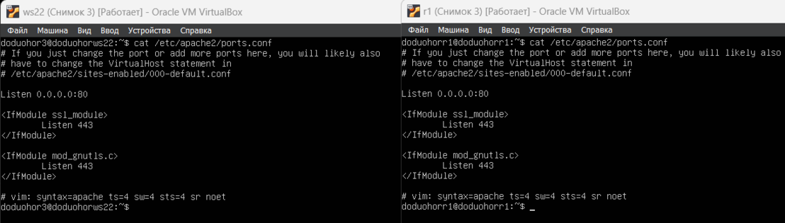

```
Запустить веб-сервер Apache командой service apache2 start на ws22 и r1
```
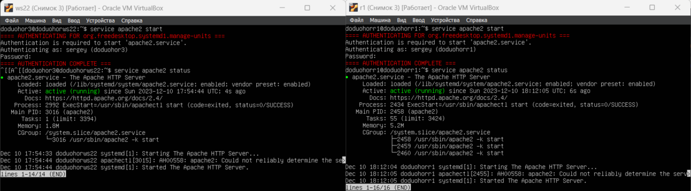

```
Добавить в фаервол, созданный по аналогии с фаерволом из Части 4, на r2 следующие правила:
1) Удаление правил в таблице filter - iptables -F
2) Удаление правил в таблице "NAT" - iptables -F -t nat
3) Отбрасывать все маршрутизируемые пакеты - iptables --policy FORWARD DROP

Запускать файл также, как в Части 4

Проверить соединение между ws22 и r1 командой ping
```

")

```
Добавить в файл ещё одно правило:
4) Разрешить маршрутизацию всех пакетов протокола ICMP

Запускать файл также, как в Части 4

Проверить соединение между ws22 и r1 командой ping
```

")

```
Добавить в файл ещё два правила:
5) Включить SNAT, а именно маскирование всех локальных ip из локальной сети, находящейся за r2 (по обозначениям из Части 5 - сеть 10.20.0.0)

6) Включить DNAT на 8080 порт машины r2 и добавить к веб-серверу Apache, запущенному на ws22, доступ извне сети
```

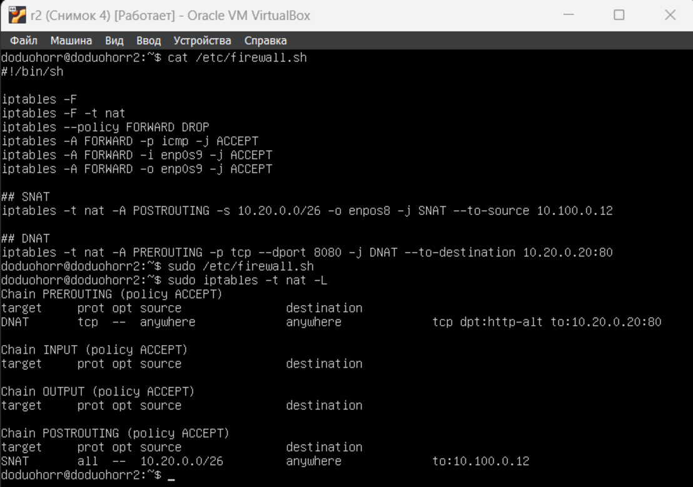

```
Проверить соединение по TCP для SNAT, для этого с ws22 подключиться к серверу Apache на r1 командой:
`telnet [адрес] [порт]`

Проверить соединение по TCP для DNAT, для этого с r1 подключиться к серверу Apache на ws22 командой telnet (обращаться по адресу r2 и порту 8080)
```
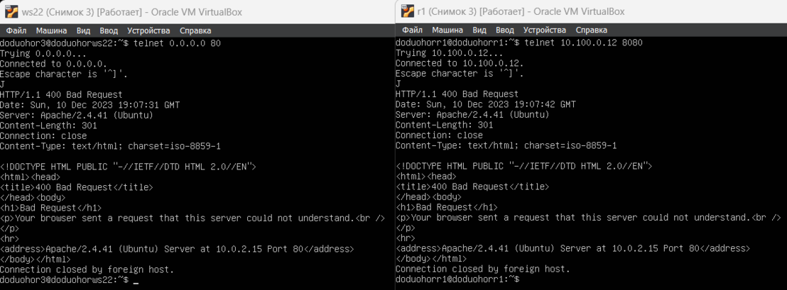

## Part 8. Дополнительно. Знакомство с SSH Tunnels


```
Запустить на r2 фаервол с правилами из Части 7

Запустить веб-сервер Apache на ws22 только на localhost (то есть в файле /etc/apache2/ports.conf изменить строку Listen 80 на Listen localhost:80)
```
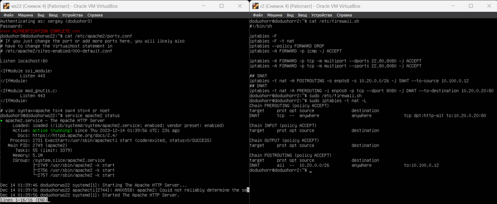

```
Воспользоваться Local TCP forwarding с ws21 до ws22, чтобы получить доступ к веб-серверу на ws22 с ws21

Воспользоваться Remote TCP forwarding c ws11 до ws22, чтобы получить доступ к веб-серверу на ws22 с ws11
```
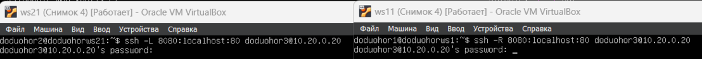

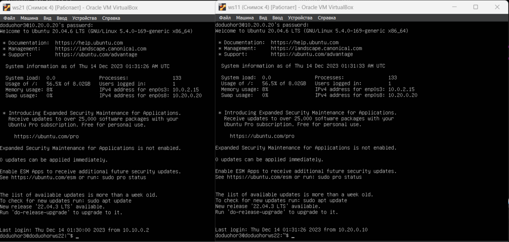

```
Для проверки, сработало ли подключение, перейдите во второй терминал (например, клавишами Alt + F2) и выполните команду:

`telnet 127.0.0.1 [локальный порт]`
```
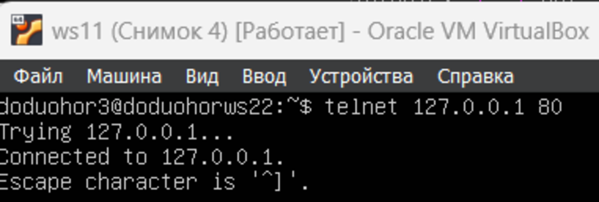